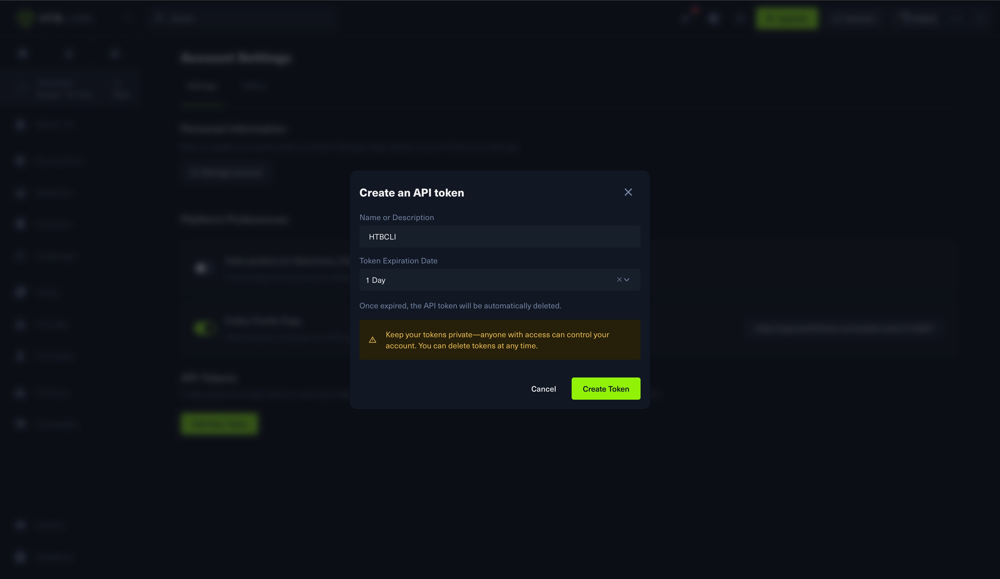
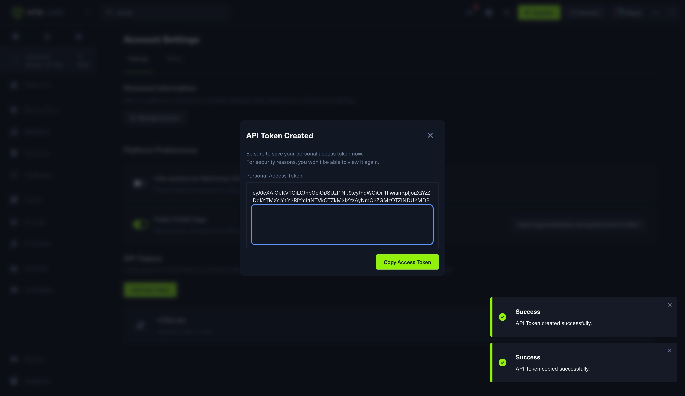
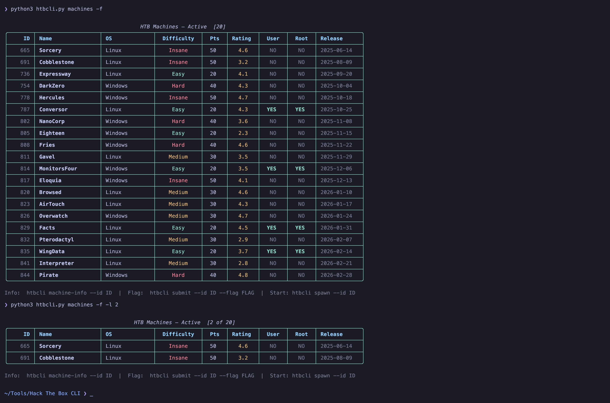
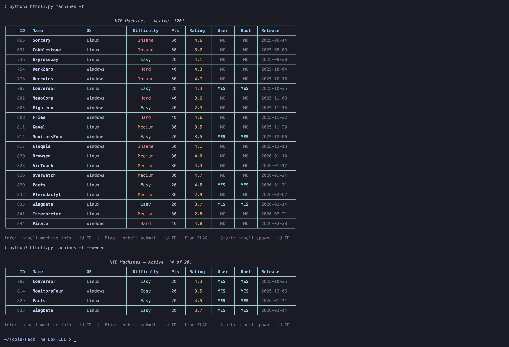
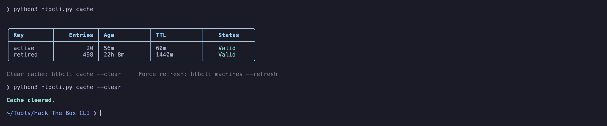

<div align="center">


</div>

# 🔰 HTBCLI

<div align="center">


**Hack The Box desde tu terminal — sin necesidad de navegador**

</div>

---

## 📖 Descripción

<p align="justify">
Una herramienta CLI rápida y completa para interactuar con Hack The Box directamente desde tu terminal. Lista máquinas, envía flags, inicia/detén/reinicia labs, consulta tus estadísticas — todo sin abrir el navegador. Desarrollado con Python, interfaz Rich UI y soporte opcional de imágenes en Kitty terminal.
</p>

> [!NOTE]
> **💡 Sobre Kitty:** [Kitty](https://sw.kovidgoyal.net/kitty/) es una terminal acelerada por GPU que soporta imágenes inline. HTBCLI usa `kitten icat` para renderizar los avatares de las máquinas. **¿No tienes Kitty? No hay problema** — todo funciona perfectamente, solo no verás las imágenes de avatar.

---

## ✨ Características

<div align="justify">

#### [+] Gestión de Máquinas
- **Listado de Máquinas** — Navega máquinas activas y retiradas con filtros (OS, dificultad, owned/pendiente)
- **Info de Máquina** — Vista detallada con avatar, dificultad, rating, tags, cantidad de solves
- **Búsqueda Inteligente** — Busca máquinas por nombre en activas y retiradas

#### [+] Envío de Flags
- **Auto-detección de Tipo** — Envía automáticamente como user o root según tu progreso
- **Rating de Dificultad** — Califica la dificultad percibida (escala 1-10) al enviar
- **Aviso si ya Owned** — Te avisa si la flag ya fue enviada

#### [+] Control del Lab
- **Spawn de Máquinas** — Inicia máquinas directamente desde CLI (servidores Free y VIP)
- **Stop/Reset** — Auto-detecta la máquina activa, no necesitas el ID
- **Máquina Activa** — Ve la máquina corriendo con su IP asignada

#### [+] Perfil y Estadísticas
- **Stats del Perfil** — Ve tu ranking, owns, bloods y progreso de rango
- **Caché Inteligente** — Caché local (activas: 1h, retiradas: 24h) para respuestas más rápidas

#### [+] Experiencia en Terminal
- **Rich UI** — Tablas, paneles, colores y barras de progreso
- **Imágenes Kitty** — Renderizado inline de avatares con layout side-by-side
- **Config Segura** — Token almacenado con permisos 600 (solo lectura del owner)

</div>

---

## ⚙️ Requisitos

<div align="justify">

| Requisito | Detalles |
|-----------|----------|
| **Python** | 3.10+ |
| **Token HTB** | [Obtén el tuyo aquí](https://app.hackthebox.com/account-settings) → API Key → Create App Token |
| **Terminal** | Cualquier terminal (Kitty recomendado para imágenes) |
| **Dependencias** | `typer`, `requests`, `rich` |

</div>

---

## 🚀 Instalación

```bash
# 1. Clonar el repositorio
git clone https://github.com/K-4yser/HTB-CLI.git
cd HTB-CLI

# 2. Instalar dependencias
pip3 install typer requests rich

# 3. (Opcional) Hacerlo ejecutable
chmod +x htbcli.py

# 4. (Opcional) Crear un alias
echo 'alias htbcli="python3 ~/HTB-CLI/htbcli.py"' >> ~/.zshrc
source ~/.zshrc
```

---

## 🔐 Configuración Inicial

### 1. Obtener tu Token de HTB

Ve a [HTB Settings → API Key](https://app.hackthebox.com/account-settings) y crea un nuevo App Token:



Copia el token generado (solo se muestra una vez):



### 2. Autenticarse

```bash
python3 htbcli.py auth --token [TU_TOKEN_AQUÍ]
```


> [!IMPORTANT]
> Tu token se almacena en `~/.config/htbcli/config.json` con permisos `600` (solo lectura/escritura del propietario).

---

## 📚 Uso

### Comandos Generales

```bash
python3 htbcli.py                  # Mostrar menú de ayuda
python3 htbcli.py --help           # Lo mismo
```


---

### 🔍 Máquinas

```bash
# Listar máquinas activas
python3 htbcli.py machines

# Listar máquinas retiradas (VIP)
python3 htbcli.py machines --retired

# Buscar por nombre (activas + retiradas)
python3 htbcli.py machines --search "Sau"

# Filtrar por OS y dificultad
python3 htbcli.py machines --os linux --diff Easy

# Solo mostrar máquinas no completadas
python3 htbcli.py machines --pending

# Solo mostrar máquinas completamente owned
python3 htbcli.py machines --owned

# Limitar resultados
python3 htbcli.py machines --limit 10

# Forzar refresh (ignorar caché)
python3 htbcli.py machines --refresh
```



---

### 📋 Info de Máquina

```bash
# Vista detallada con avatar (Kitty), dificultad, rating, tags, solves
python3 htbcli.py machine-info --id 573
```


---

### 🚩 Envío de Flags

```bash
# Enviar flag (auto-detecta user o root según estado de owned)
python3 htbcli.py submit --id 573 --flag abc123...def456

# Enviar explícitamente como root
python3 htbcli.py submit --id 573 --flag abc123...def456 --type root

# Con dificultad percibida (escala 1-10, como HTB)
python3 htbcli.py submit --id 573 --flag abc123...def456 --diff 4
```


> [!TIP]
> **Auto-detección:** Si ya tienes la flag de user, el siguiente submit va automáticamente como root. Si ambas están owned, te avisa en lugar de fallar.

---

### ⚡ Control del Lab

```bash
# Iniciar una máquina
python3 htbcli.py spawn --id 573

# Usar servidor VIP
python3 htbcli.py spawn --id 573 --vip

# Mostrar máquina activa + IP
python3 htbcli.py active

# Detener (auto-detecta máquina activa)
python3 htbcli.py stop

# Reiniciar
python3 htbcli.py reset
```


---

### 👤 Perfil

```bash
# Mostrar estadísticas de tu perfil
python3 htbcli.py profile
```

---

### 💾 Caché

```bash
# Mostrar estado del caché
python3 htbcli.py cache

# Limpiar caché
python3 htbcli.py cache --clear
```



---

## 🗂️ Archivos de Configuración

| Archivo | Propósito |
|---------|-----------|
| `~/.config/htbcli/config.json` | Token de API (chmod 600) |
| `~/.config/htbcli/cache.json` | Caché de lista de máquinas |

### Tamaño de Imágenes

Ajusta el tamaño de los avatares editando las constantes al inicio de `htbcli.py`:

```python
MACHINE_INFO_IMG_COLS = 31   # comando machine-info
ACTIVE_IMG_COLS       = 26   # comando active

# 25 = pequeño | 31 = mediano | 50 = grande
```

---

## 🔧 Cómo Funciona

<div align="justify">

| Componente | Descripción |
|------------|-------------|
| **API** | Se comunica con HTB API v4 (`labs.hackthebox.com/api/v4`) |
| **Renderizado UI** | Usa Rich para paneles, tablas, barras de progreso, colores |
| **Soporte Imágenes** | `kitten icat` de Kitty con `--place` para posicionamiento preciso |
| **Layout** | Secuencias de escape ANSI (DSR para cursor, CUP para posicionamiento) |
| **Caché** | Archivo JSON simple con TTL por clave |

</div>

---

## 🛠️ Stack Tecnológico

| Componente | Tecnología |
|------------|------------|
| Framework CLI | [Typer](https://typer.tiangolo.com/) |
| UI de Terminal | [Rich](https://github.com/Textualize/rich) |
| Cliente HTTP | [Requests](https://docs.python-requests.org/) |
| Renderizado de Imágenes | [Kitty](https://sw.kovidgoyal.net/kitty/) `kitten icat` |
| API | HTB API v4 |

---

## 🤝 Contribuciones

¿Encontraste un bug o tienes una idea? [Abre un issue](https://github.com/K-4yser/HTB-CLI/issues).

¿Quieres contribuir código? Fork → Branch → PR. ¡Todas las contribuciones son bienvenidas!

---

## 👨‍💻 Autor

<div align="center">

**Jean Pierre Montalvo** (K-4yser)

[](https://github.com/K-4yser)
[](https://www.linkedin.com/in/jean-montalvo)
[](https://app.hackthebox.com/public/users/416937)

</div>

---

## 📄 Licencia

MIT — ver [LICENSE](LICENSE) para más detalles.

---

<div align="center">

**⭐ Dale star a este repo si te resulta útil!**

*Hecho con ❤️ para la comunidad de HTB*

</div>
